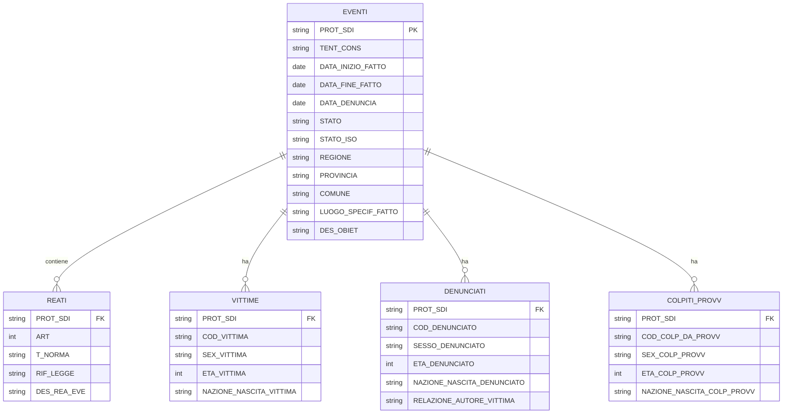

# Dataset SDI reati di genere - output processati

**Data elaborazione:** 2025-11-18
**File sorgente:** `../rawdata/MI-123-U-A-SD-2025-90_6.xlsx`
**Righe originali:** 5.124
**Eventi unici:** 2.644

## Problemi risolti

Il file Excel originale presentava due criticità principali che lo rendevano inutilizzabile per analisi statistiche affidabili:

- **49.4% di duplicati esatti** - 2.534 righe completamente identiche dovute a errore di estrazione
- **Prodotto cartesiano** - relazione artificiale tra denunciati e colpiti da provvedimento che generava combinazioni senza senso logico

### Premessa: I due problemi del file XLSX

Il file Excel di input conteneva due problemi distinti:

**Duplicati (errore tecnico):**

- Righe completamente identiche in tutti i campi
- Esempio: evento `BSCS352024000004` con 30 righe identiche

**Prodotto cartesiano (struttura non documentata):**

- Quando un evento ha più denunciati E più persone colpite da provvedimento
- Ogni denunciato viene abbinato a OGNI persona colpita da provvedimento
- Esempio: evento `PGPQ102023002369` con 6 denunciati × 6 colpiti_provv = 36 righe
- Le combinazioni generate includono tutti gli abbinamenti possibili tra denunciati e persone colpite da provvedimento

## Output disponibili

Sono stati generati 3 tipi di output per soddisfare diverse esigenze analitiche:

### Prodotto cartesiano (dedupplicato non aggregato)

**File:** [`dataset_cartesiano.csv`](dataset_cartesiano.csv)

**Righe:** 3.329

**Struttura:** 1 riga per ogni combinazione denunciato × vittima × reato × colpito_provv

**Quando usarlo:**

- Analisi che richiedono vedere tutte le combinazioni possibili
- Ricerca di soggetti specifici in formato "flat"
- Esportazione diretta in Excel per utenti non tecnici

**Limitazioni:**

- Contiene prodotto cartesiano artificiale (es. PGPQ102023002369: 36 righe per 1 evento)
- Richiede documentazione esplicita: "1 riga = 1 combinazione"
- Conteggi eventi richiedono `count(DISTINCT PROT_SDI)`

### Tabella unica con array (soluzione consigliata)

**File:** [`dataset_array.csv`](dataset_array.csv)

**Righe:** 2.644 (1 per evento)

**Struttura:** 1 riga = 1 evento, soggetti multipli in array

**Quando usarlo:**

- Statistiche aggregate (conteggi eventi, trend temporali)
- Analisi geografiche per regione/provincia
- Dashboard e visualizzazioni dati
- Query efficienti su dataset completo

**Vantaggi:**

- Granularità chiara: 1 riga = 1 evento
- Conteggi diretti: `count(*)` = eventi totali
- Nessun prodotto cartesiano artificiale
- Tutte le relazioni preservate

### Modello relazionale (database)

**File:** 5 tabelle separate

- [`relazionale_eventi.csv`](relazionale_eventi.csv) (2.644 righe)
- [`relazionale_reati.csv`](relazionale_reati.csv) (2.908 righe)
- [`relazionale_vittime.csv`](relazionale_vittime.csv) (2.821 righe)
- [`relazionale_denunciati.csv`](relazionale_denunciati.csv) (2.856 righe)
- [`relazionale_colpiti_provv.csv`](relazionale_colpiti_provv.csv) (2.762 righe)

**Database:** [`reati_sdi_relazionale.duckdb`](reati_sdi_relazionale.duckdb)

**Quando usarlo:**

- Database persistenti e applicazioni
- Analisi complesse con query SQL
- JOIN tra tabelle per analisi multidimensionali
- Sistemi che richiedono normalizzazione

**Schema ER:**



## Statistiche comparativa

| Approccio | File/righe | Eventi | Vittime | Denunciati | Colpiti provv |
|-----------|------------|--------|---------|------------|---------------|
| **Cartesiano** | 1 file / 3.329 righe | 2.644* | 2.821* | 2.856* | 2.762* |
| **Array** | 1 file / 2.644 righe | 2.644 | 2.821 | 2.856 | 2.762 |
| **Relazionale** | 5 file / 13.931 righe | 2.644 | 2.821 | 2.856 | 2.762 |

*Richiede `count(DISTINCT campo)` per conteggi accurati

## Media per evento

- **Vittime:** 1.06 per evento
- **Denunciati:** 1.05 per evento
- **Colpiti da provvedimento:** 1.04 per evento

## Come usare i dati

### Per analisi aggregate (consigliato)
```sql
-- Eventi per regione
SELECT REGIONE, count(*) as n_eventi
FROM read_csv('dataset_array.csv')
GROUP BY REGIONE
ORDER BY n_eventi DESC;
```

### Per analisi relazionali
```sql
-- Eventi con multipli reati
SELECT e.PROT_SDI, count(*) as n_reati
FROM read_csv('relazionale_eventi.csv') e
JOIN read_csv('relazionale_reati.csv') r ON e.PROT_SDI = r.PROT_SDI
GROUP BY e.PROT_SDI
HAVING count(*) > 1;
```

### Per ricerca soggetti specifici
```sql
-- Trova vittima per codice
SELECT * FROM read_csv('dataset_cartesiano.csv')
WHERE COD_VITTIMA = '20220728121231234989';
```

## Note tecniche

**Pulizia dati:**

- Tutti i campi testuali sono stati trimmati per rimuovere spazi extra
- Valori NULL rappresentati con celle vuote (non `(null)`)
- Array vuoti rimossi dai file aggregati
- I dati temporali mantengono il formato originale
- I codici fiscali/persona sono stati normalizzati

**Codici geografici:**

- Campo `STATO_ISO`: codici ISO 3166-1 alpha-3 (ITA, FRA, ESP, CHE, etc.)
- Eventi senza STATO esplicito: mappati automaticamente a ITALIA → ITA
- Codici speciali: UNK (ignoto), INT (acque internazionali)
- Mapping completo in [`resources/codici_stati.csv`](../../resources/codici_stati.csv)
