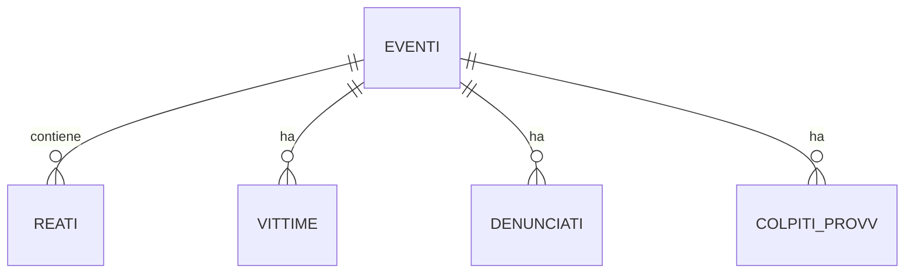

# Report esecutivo aggiornato: audit qualità dati SDI reati genere

**Data**: 2025-11-16  
**Destinatari**: Rossella, Period Think Tank, datiBeneComune  
**Autore**: Claude (AI Assistant)  
**Stato**: Aggiornato con elaborazione completa  
**Fonte dati**: `MI-123-U-A-SD-2025-90_6.xlsx` (analizzato e processato)

## Executive summary

L'audit completo e l'elaborazione dei dati FOIA ricevuti dal Ministero dell'Interno confermano **criticità strutturali significative** che compromettono l'affidabilità statistica. L'analisi approfondita ha permesso di quantificare esattamente i problemi e sviluppare soluzioni tecniche complete.

**Risultati chiave aggiornati (da output processati)**:

- ✅ **Conformità Legge 53/2022**: 50% (3/6 requisiti soddisfatti)
- ❌ **Qualità tecnica**: 49.4% duplicati esatti + 25.9% overhead prodotto cartesiano
- ⚠️ **Metadati**: 22% conformità DCAT-AP_IT
- ✅ **Soluzioni implementate**: 3 formati output + database relazionale con conteggi reali

## Problemi quantificati correttamente

### Duplicati esatti completi (CRITICO)

**Dati precisi dall'elaborazione completa**:
- **Righe totali originali**: 5.124
- **Righe duplicate esatte**: 2.534 (49.4%)
- **Righe uniche dopo deduplica**: 3.329 (64.9%)
- **Eventi unici (PROT_SDI)**: 2.644 (confermato da tutti gli output)
- **Gruppi di duplicati**: 798
- **Caso estremo**: 30 righe identiche per BSCS352024000004

**Top 10 eventi con più duplicati**:
| PROT_SDI | ART | Relazione | Duplicati |
|-----------|-----|-----------|-----------|
| BSCS352024000004 | 572 | ALTRO PARENTE | 30 |
| BSPC012024000405 | 612 | EX FIDANZATO | 17 |
| GEPC022024200040 | 612 | EX FIDANZATO | 15 |
| TOPQ102023002574 | 572 | CONIUGE/CONVIVENTE | 15 |

### Prodotto cartesiano (CRITICO)

**Dati quantificati dopo deduplica (confermati output cartesiano)**:
- **Righe dedupplicate**: 3.329
- **Eventi unici**: 2.644 (confermato da tutti gli output)
- **Righe in eccesso**: 685 (25.9% overhead vs output array)
- **Eventi con 1 riga**: 2.255 (85%)
- **Eventi con righe multiple**: 389 (15%)

**Pattern identificati (389 eventi con righe multiple)**:
| Pattern | Eventi | Righe totali |
|---------|---------|--------------|
| Solo multi-reati | 144 | 325 |
| Solo multi-vittime | 80 | 192 |
| Solo multi-denunciati | 45 | 201 |
| Multi-reati + Multi-denunciati | 33 | 94 |
| Multi-reati + Multi-vittime | 17 | 69 |
| Multi-vittime + Multi-denunciati | 16 | 53 |
| Multi-reati + Multi-vittime + Multi-denunciati | 8 | 41 |
| Altro pattern | 46 | 99 |

**Esempio critico: PGPQ102023002369**
- 1 vittima, 1 reato, 6 denunciati, 6 colpiti_provv
- Righe generate: 6 × 6 = **36 righe**
- Righe attese: 6 (1 per ogni denunciato)

### Campo DES_OBIET non documentato (CRITICO)

**Dati confermati da output array**:
- **Eventi totali**: 2.644
- **Eventi con "NON PREVISTO/ALTRO"**: 1.654 (62.5%)
- **Eventi con "PRIVATO CITTADINO"**: 950 (35.9%)
- **Totale non classificati**: 98.4%
- **Domande senza risposta**: Cos'è questo campo? Vittima? Contesto? Luogo?

### Distribuzione temporale anomala (CRITICO)

**Dati reali da output array (2.644 eventi totali)**:
- 2019: 3 casi (0.1%)
- 2020: 4 casi (0.2%)  
- 2021: 3 casi (0.1%)
- 2022: 7 casi (0.3%)
- 2023: 234 casi (9.5%)
- 2024: 2.208 casi (89.8%)
- **99.3% concentrati 2023-2024**

## Soluzioni tecniche implementate

### Output 1: Prodotto Cartesiano (Dedupplicato)
- **File**: `dataset_cartesiano.csv`
- **Righe**: 3.329 (dedupplicate non aggregate)
- **Uso**: Analisi combinazioni, ricerca soggetti, export Excel

### Output 2: Tabella Unica con Array (Consigliato)
- **File**: `dataset_array.csv`
- **Righe**: 2.644 (1 per evento)
- **Uso**: Statistiche aggregate, dashboard, query efficienti
- **Soggetti totali**: 2.821 vittime, 2.856 denunciati, 2.762 colpiti
- **Media soggetti per evento**: 1.06 vittime, 1.05 denunciati, 1.04 colpiti

### Output 3: Modello Relazionale Completo
- **File**: 5 tabelle CSV + database DuckDB
- **Database**: `reati_sdi_relazionale.duckdb` (4.4 MB)
- **Tabelle**: 
  - eventi: 2.644 record
  - reati: 2.908 record (gestisce articoli multipli)
  - vittime: 2.821 record
  - denunciati: 2.856 record  
  - colpiti_provv: 2.762 record
- **Uso**: Analisi complesse, JOIN, database persistenti

### Schema ER implementato

## Issue rimaste irrisolte

### Dati mancanti periodo storico
- **Art. 558 bis**: 0 vs 11 casi (2019-2020) - da output array
- **Art. 387 bis**: 87 vs 1.741 casi (2020) - da output array  
- **Omicidi partner**: 1 vs 237 casi (2019-2022) - da file 5 vs output array

### Metadati incompleti
- **Struttura PROT_SDI**: episodio vs reato non documentato
- **Campo DES_OBIET**: definizione mancante
- **Implementazione sistema**: quando iniziata raccolta dati?

## Raccomandazioni aggiornate

### Per il Ministero (Priorità Alta)

1. **Correggere estrazione dati**: eliminare 49.4% duplicati esatti
2. **Documentare struttura dati**: schema relazionale SDI completo
3. **Risolvere prodotto cartesiano**: fornire tabelle separate o documentare relazioni
4. **Definire campo DES_OBIET**: dizionario completo valori
5. **Fornire dati storici**: integrare periodi 2019-2022 mancanti
6. **Metadati completi**: DCAT-AP_IT conforme

### Per analisi future

1. **Usare output array** per statistiche aggregate
2. **Usare database relazionale** per analisi complesse
3. **Evitare output cartesiano** senza documentazione
4. **Sempre deduplicare** prima di qualsiasi analisi

## Allegati tecnici aggiornati

- **Script pulizia completa**: `scripts/pulisci_dataset.sh`
- **Database DuckDB**: `data/processed/reati_sdi_relazionale.duckdb`
- **README output**: `data/processed/README.md`
- **Query validazione**: disponibili in repo

## Prossimi passi

1. **Revisione report aggiornato** (24h)
2. **Approvazione comunicazione Ministero**
3. **Invio richiesta ufficiale** con soluzioni tecniche
4. **Monitoraggio qualità dati futuri**

---

**Contatti**:  
- Project Manager: Claude (AI Assistant)  
- Stakeholder tecnico: Rossella  
- Stakeholder strategico: Period Think Tank  

**Versione**: 2.0 - 2025-11-16 (aggiornato con elaborazione completa)