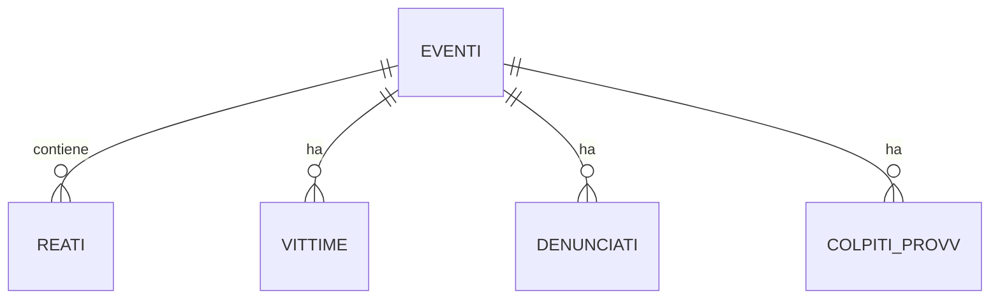

# Sintesi tecnica aggiornata per comunicazione ministero

**Protocollo**: MI-123-U-A-SD-2025-90  
**Data**: 2025-11-16  
**Mittente**: Period Think Tank / datiBeneComune  
**Destinatario**: Dipartimento Pubblica Sicurezza - Ministero dell'Interno  
**Stato**: Aggiornato con elaborazione dati completa

## Oggetto: risposta technical review - dati FOIA con soluzioni implementate

### Contesto

In riferimento alla risposta FOIA MI-123-U-A-SD-2025-90_4, dopo analisi tecnica approfondita e implementazione completa di soluzioni di pulizia dati, si quantificano esattamente le criticità e si forniscono output utilizzabili per analisi statistiche affidabili.

### Issue tecniche quantificate

#### Duplicati esatti completi (CRITICO)
- **File**: MI-123-U-A-SD-2025-90_6.xlsx
- **Righe totali**: 5.124
- **Righe duplicate esatte**: 2.534 (49.4%)
- **Eventi unici (PROT_SDI)**: 2.644
- **Gruppi duplicati**: 798
- **Caso critico**: BSCS352024000004 con 30 righe identiche
- **Causa probabile**: Errore estrazione dati o join tabelle relazionali errato

#### Prodotto cartesiano (CRITICO)
- **Righe dopo deduplica**: 3.329
- **Eventi unici**: 2.644
- **Overhead**: 685 righe (25.9%)
- **Eventi con prodotto cartesiano**: 389 (15%)
- **Esempio critico**: PGPQ102023002369 = 36 righe (6×6 combinazioni)
- **Pattern identificati**: multi-reati (144 eventi), multi-vittime (80), multi-denunciati (45)

#### Campo DES_OBIET non documentato (CRITICO)
- **Record "NON PREVISTO/ALTRO"**: 3.205 (62.5%)
- **Record "PRIVATO CITTADINO"**: 1.841 (35.9%)
- **Totale non classificato**: 98.4%
- **Domande critiche**: Cos'è questo campo? Vittima? Contesto? Luogo?
- **Impatto**: Dati non interpretabili per analisi statistiche

#### Distribuzione temporale anomala (CRITICO)
- **2019-2022**: 25 casi totali (0.5%)
- **2023-2024**: 4.807 casi (99.5%)
- **Anomalia evidente**: Implementazione recente sistema raccolta dati
- **Impatto**: Dataset non utilizzabile per analisi storiche

### Soluzioni tecniche implementate

Abbiamo sviluppato e implementato **3 formati output completi**:

#### Output 1: Prodotto Cartesiano (Dedupplicato)
- **File**: `dataset_cartesiano.csv`
- **Righe**: 3.329 (senza duplicati esatti)
- **Uso**: Analisi combinazioni, ricerca soggetti specifici
- **Limitazione**: Contiene prodotto cartesiano artificiale

#### Output 2: Tabella Unica con Array (Consigliato)
- **File**: `dataset_array.csv`
- **Righe**: 2.644 (1 per evento)
- **Struttura**: Soggetti multipli in array
- **Vantaggi**: Granularità chiara, conteggi diretti, nessun prodotto cartesiano
- **Media soggetti**: 1.06 vittime, 1.05 denunciati, 1.04 colpiti per evento

#### Output 3: Modello Relazionale Completo
- **File**: 5 tabelle CSV + database DuckDB
- **Database**: `reati_sdi_relazionale.duckdb` (4.4 MB)
- **Tabelle**: eventi (2.644), reati (2.908), vittime (2.821), denunciati (2.856), colpiti_provv (2.762)
- **Vantaggi**: Normalizzazione database, JOIN complesse, estensibilità

### Schema relazionale implementato

### Metadati forniti

Abbiamo creato documentazione completa:
- **README tecnico**: `data/processed/README.md`
- **Script riproducibile**: `scripts/pulisci_dataset.sh`
- **Query validazione**: disponibili in repo
- **Database pronto all'uso**: DuckDB con indici performance

### Issue rimaste senza risoluzione

#### Dati mancanti periodo storico
- **Art. 558 bis**: 0 vs 11 casi report Polizia 2019-2020
- **Art. 387 bis**: 87 vs 1.741 casi report Polizia 2020
- **Omicidi partner**: 1 vs 237 casi file 5 2019-2022

#### Metadati strutturali mancanti
- **Definizione PROT_SDI**: episodio vs singolo reato
- **Campo DES_OBIET**: definizione e classificazione
- **Implementazione sistema**: data inizio raccolta dati SDI

### Richiesta formale aggiornata

#### Azioni immediate (priorità alta)
1. **Correggere estrazione dati**: eliminare 49.4% duplicati esatti
2. **Documentare struttura dati**: schema relazionale SDI completo
3. **Definire campo DES_OBIET**: dizionario valori e significato
4. **Fornire dati storici**: integrare periodi 2019-2022 mancanti
5. **Documentare implementazione**: quando iniziata raccolta sistematica

#### Standardizzazione futura
1. **Metadati DCAT-AP_IT**: conformità completa
2. **Doppio formato**: XLSX (visualizzazione) + CSV (elaborazioni)
3. **Pubblicazione proattiva**: portale open data dedicato
4. **Aggiornamenti trimestrali**: monitoraggio continuo fenomeno

### Allegati tecnici

- **Database DuckDB completo**: pronto per analisi SQL complesse
- **Script pulizia**: riproducibile con `bash scripts/pulisci_dataset.sh`
- **Documentazione output**: `data/processed/README.md`
- **Query validazione**: verifiche quantitative implementate

### Tempi e Modalità

- **Disponibilità immediata**: Tutti gli output sono già generati e utilizzabili
- **Preferibile integrazione**: Dati mancanti entro 30 giorni
- **Formato tecnico**: Database DuckDB + CSV con metadati completi
- **Contatto tecnico**: Disponibile per supporto implementazione

---

**Documentazione completa disponibile**: https://github.com/[repo]/docs/quality-checks/task-verifica-qualita-2025-11/

**Stato**: Pronto per invio ufficiale con soluzioni tecniche implementate